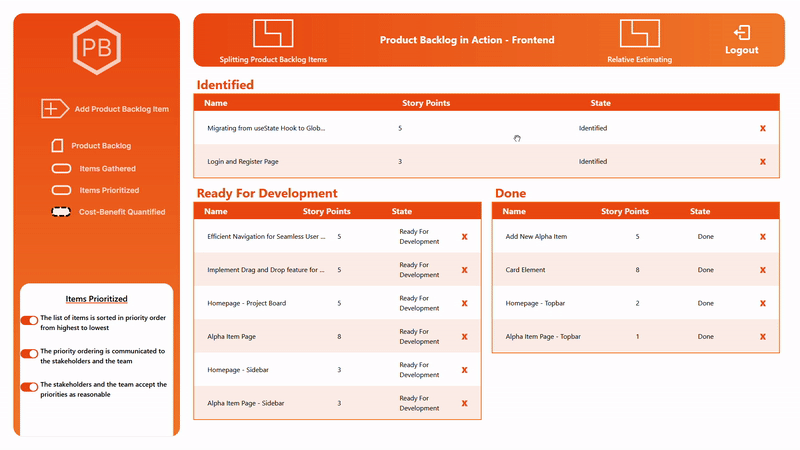
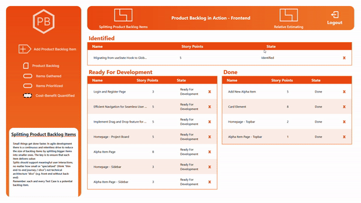
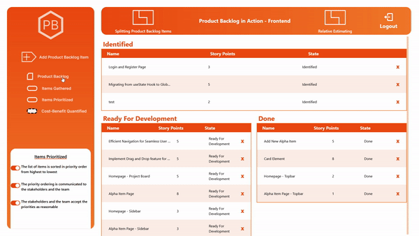
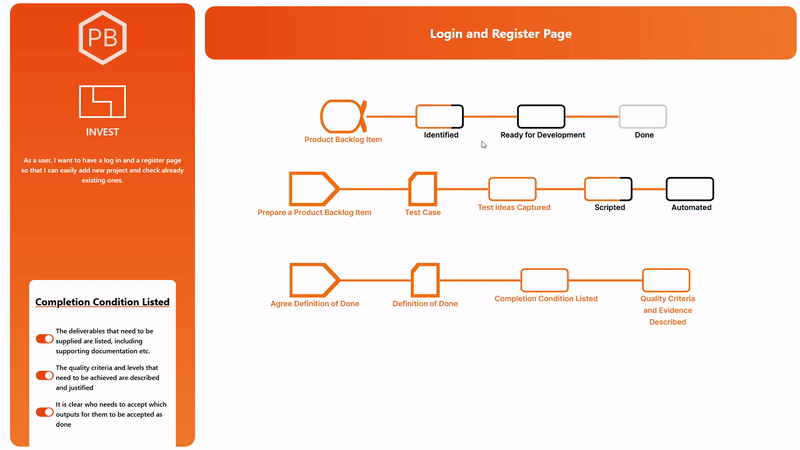
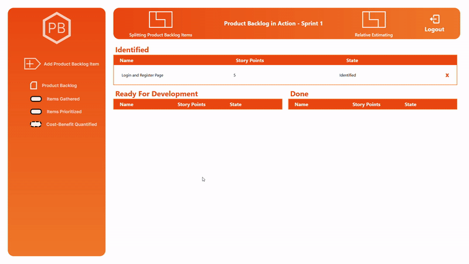

# Product Backlog in Action

🚧 DUE TO BUDGET CONSTRAINTS (no budget at all...) YOU WILL HAVE TO WAIT A FEW MINUTES FOR THE PLATFORM TO WORK (the backend will spin off after certain time and takes a few moments to redeploy)
THANK YOU FOR YOUR UNDERSTANDING

## Table of Contents

- [About Product Backlog in Action](#about-product-backlog-in-action)
- [Main Features](#main-features)
- [Technical Details](#technical-details)
- [Acknowledgements](#acknowledgements)

## About Product Backlog in Action

This is a mental and software construction of the ideas proposed by Ivar Jacobson, SEMAT and OMG - The Essence Standard.

### Mission of Product Backlog in Action

The mission of the product is to facilitate the increase of quality of the development process of a software product and to offer a profound understanding of the development direction

### What PBA is?

The project aims to assist teams in developing software products. Appearing in the form of a Task Management System, PBA offer some additional functionalities focused to increase the quality and to offer healthchecks of the Product Backlog

### What PBA is NOT?

The application is **NOT** a replacement of any already existent management tool. PBA offer a different view and approach to enchance the understading and mitigate risk at early stages.

### Detailed Project Description

This project aims to assist teams in developing software products according to essentialized Product Backlog Practice. Providing an overview of the items in the backlog, prioritization of issues, and roadmaps for advancing the Product Backlog and each item, the application serves as the bridge between Agile Methodologies and the previous missing theory of Product Backlog development. By providing a translation from the Product Backlog Essentials into a concrete application, the creation of a Product Backlog is not only assured, but the quality of it is also measurable. Providing constant feedback on each issue by comparing it against a roadmap is a quick health check for each item. Furthermore, users are encourged to choose a modular way to structure their work by registering the project itself (this can be consisted of multiple way of dividing the project, for example, an unique product backlog project, two different product backlogs: one for the frontend, another for the backend of the application or even into Sprint Backlogs), encouraging teamwork over a project.
<br />

## Main Features

- Product Backlog overview - Project Board

  - Classify items according to their internal states (Identified, Ready For Development, Done)
  - Provides an overview of all Product Backlog items and their progress
  - Helps understand what is done and what needs to be done next
  - Allows prioritization using drag-and-drop features
    

- Refining Product Backlog activities - Sidebars
  - "Add Product Backlog Item" button for adding new items
  - The "Add Product Backlog Item" button displays a form for adding new items
  - Teams can quickly add new items with essential information: title, description, and story points
  - Invalid input prevents item creation; valid input updates the main page view accordingly - Allows simultaneous viewing of main page elements, including Pattern cards
    
  - Represents the "Refine Product Backlog" activity and patterns
  - Emphasizes elements of the Essence Language such as Pattern Cards that coach users into taking actions and Work Products that depicts states and future directions
  - Previews current and potential states of the "Product Backlog" using checklists
    
- Product Backlog Item Manager - Item Manager
  - Accesed by double clicking any issue
  - Crucial interface for ensuring Product Backlog quality
  - Depicts internal state of every individual item in the Product Backlog
  - Product Backlog Item Alpha
    - Includes states: "Identified", "Ready for Development", and "Done" - Tables named after alpha states, inspired by Essence Standard
    - Unfinished checklist items indicate incomplete states (black borders, white-filled elements) - Complete states highlighted with orange borders
    - Some states are disabled until all necesarry steps are done (information available on hover)
      
- Assisted Progression
  - Items automatically get classified based on the internal state
  - Progressing the state of the alpha item will also progress the issue
    

## Technical Details

### Application Technologies

In terms of architecture, the Product Backlog assistant will be accessible as a web application. Considering this, the application provides two different services, one modeling the front end, responsible for visual aspects and application logic, and another providing mutation to the database as a RESTful API.

### Backend Technologies

The backend consist of the following technologies Typescript, NodeJS, ExpressJS, Mongoose for accesing MongoDB, JWT and BCrypt for project registration andDotEnv

### Frontend Technologies

The frontend consist of the following technologies Typescript, Vite, React, Tailwind, React Router DOM, Axios, React Query, Zustand, React Beautiful Drag And Drop, Vitest, React Icons & React Xarrow

### How to Run

#### Prerequisites

- node >=18.15.0
- npm >=9.5.0

The application connect a frontend component to a backend component. Both must be running simultaneously for the application to work.
<br>

### Run the Backend

```
npm install
```

```
npm run dev
```

### Important aspect about backend privacy

The following backend service make use of the `dotenv` to load secret strings into the code. To run this application a `.env` file have to be created containing the following information and respecting the following structure:
<br>

```
PORT=PORT_IN_INTEGER
MONGODB_URI="MONGODB_CONNECTION_URI"
SECRET_STRING=SECRET_KEY_WITHOUT_QUOTATIONS
```

In order to generate a MONGODB_URI, that is a MongoDB string used for connecting to the cloud cluster, one have to create its own cluster in the [MongoDB Atlas](https://www.mongodb.com/atlas/database). (More information about this process can be found [here](https://www.mongodb.com/basics/clusters/mongodb-cluster-setup))

### Run the Frontend

```
npm install
```

```
npm run dev
```

```
npm run test
```

## Acknowledgements

There is a lot of effort put in this project. None of this could have been possible without the help of my coordinator Dr. Cristina Mîndruță to which I sincerly declare my profound appreciation.

Moreover please find my Bachelor's Thesis document attached in this repository for a better understanding of the whole thinking project.
