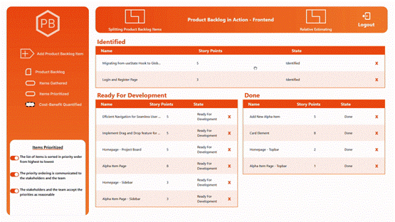

# Product Backlog in Action

<br />

## Table of Contents

- [About Product Backlog in Action](#introduction)
- [Features](#features)
- [Installation](#installation)
- [Usage](#usage)
- [Configuration](#configuration)
- [Contributing](#contributing)
- [License](#license)
- [Contact](#contact)
- [Acknowledgements](#acknowledgements)

## About Product Backlog in Action

### Mission of Product Backlog in Action

The mission of the product is to facilitate the increase of quality of the development process of a software product and to offer a profound understanding of the development direction

### What PBA is?

The project aims to assist teams in developing software products. Appearing in the form of a Task Management System, PBA offer some additional functionalities focused to increase the quality and to offer healthchecks of the Product Backlog

### What PBA is NOT?

The application is **NOT** a replacement of any already existent management tool. PBA offer a different view and approach to enchance the understading and mitigate risk at early stages.

### Detailed Project Description

This project aims to assist teams in developing software products according to essentialized Product Backlog Practice. Providing an overview of the items in the backlog, prioritization of issues, and roadmaps for advancing the Product Backlog and each item, the application serves as the bridge between Agile Methodologies and the previous missing theory of Product Backlog development. By providing a translation from the Product Backlog Essentials into a concrete application, the creation of a Product Backlog is not only assured, but the quality of it is also measurable. Providing constant feedback on each issue by comparing it against a roadmap is a quick health check for each item. Furthermore, users are encourged to choose a modular way to structure their work by registering the project itself (this can be consisted of multiple way of dividing the project, for example, an unique product backlog project, two different product backlogs: one for the frontend, another for the backend of the application or even into Sprint Backlogs), encouraging teamwork over a project.
<br />

## Main Features

- Product Backlog overview - Project Board



## **Application Technologies**

In terms of architecture, the Product Backlog assistant will be accessible as a web application. Considering this, the application provides two different services, one modeling the front end, responsible for visual aspects and application logic, and another providing mutation to the database as a RESTful API.

### **Backend Technologies**

The backend consist of the following technologies:
<br>

0. Typescript
1. NodeJS
2. ExpressJS
3. Mongoose for accesing MongoDB
4. JWT and BCrypt for project registration
5. DotEnv

### **Frontend Technologies**

The frontend consist of the following technologies:
<br>

0. Typescript
1. Vite
1. React
1. Tailwind
1. React Router DOM
1. Axios
1. React Query
1. Zustand
1. React Beautiful Drag And Drop
1. Vitest
1. React Icons & React Xarrow

## **How to Run**

## **Prerequisites**

- node >=18.15.0
- npm >=9.5.0

The application connect a frontend component to a backend component. Both must be running simultaneously for the application to work.
<br>

## **Run the Backend**

<br/>

### **Dependency instalation**

<br>

```
npm install
```

#### **Run Service**

```
npm run dev
```

#### **IMPORTANT ASPECT ABOUT BACKEND PRIVACY**

The following backend service make use of the `dotenv` to load secret strings into the code. To run this application a `.env` file have to be created containing the following information and respecting the following structure:
<br>

```
PORT=PORT_IN_INTEGER
MONGODB_URI="MONGODB_CONNECTION_URI"
SECRET_STRING=SECRET_KEY_WITHOUT_QUOTATIONS
```

In order to generate a MONGODB_URI, that is a MongoDB string used for connecting to the cloud cluster, one have to create its own cluster in the [MongoDB Atlas](https://www.mongodb.com/atlas/database). (More information about this process can be found [here](https://www.mongodb.com/basics/clusters/mongodb-cluster-setup))

## **Run the Frontend**

<br/>

### **Dependency instalation**

<br>

```
npm install
```

#### **Run Service**

```
npm run dev
```

#### **Run Tests**

```
npm run test
```
